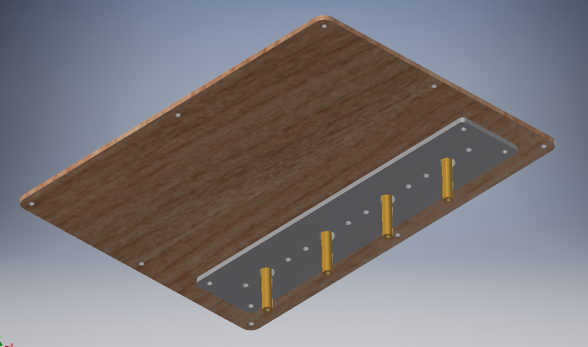

# lasercutkalimba
A diy kalimba with laser-cut, plasma-cut and 3d-printed parts.
(Or a story about how a physicist/electrical enginer tried to engineer a musical instrument)

[Link to the youtube video of building this kalimba](https://youtu.be/Hq4BJ8A1Kc0)

# List of parts

Please refer to the "parts modification" and "assembly chapters first since most of these parts can be changed a bit.

### Laser-cut, plasma-cut and 3d-printed parts

* Bottom soundboard - laser-cut 3mm plywood, see **bottom.xxx** in stl, pdf or dxf folders.
* Top soundboard - laser-cut 3mm plywood, see **top.xxx** in the same folders
* Side soundboard - four laser-cut 5mm plywood pieces glued together. I've made two versions - **side-v1.xxx** and **side-v2.xxx**, the first one is the one I am using in the video, the second one has thinner walls.
* Top metal part - plasma-cut 3mm stainless steel, see **top-holder.xxx**
* Bottom metal part - plasma-cut 3mm stainless steel, see **bottom-holder.xxx**
* Tines bracket - 3d-printed part, see **bracket.stl** in the STL folder. It is designed for two 3x44mm metal rods to be inserted into it, so that the metal part will be pushing on the tines, not plastic. If you are okay with plastic being in contact with tines, there is another completely 3d-printable version - **bracket-2.stl** with cuts for 6 tines.

### Besides these parts, you will also need:

* A bunch of 2mm metal rods for tines. I've just bought a few RC car axes. The particular metal is up to you and a bit of experimentation, it depends on what you can get in you location. If you are in Moscow, [these are the axes that I've used](https://tixer.ru/catalog/robotics/axis/os_2_x_150mm/).
* 8 3x44mm metal rods if you are going with the **bracket.stl** file to be inserted in the bracket. Of course, you can buy larger ones and cut them down to size. [Link to the rods that I've used](https://tixer.ru/catalog/robotics/axis/os_3_x_150mm/).
* 8 hexagonal brass PCB standoffs with holes on both sides, M3x20mm or (even better, if you want to have some clearance) M3x18mm.
* 4 round or hexagonal brass M3 PCB stanoffs used for the sound poles. They need to have holes on both sides. The length is dependant upon which length M3 screws you are using. The perfect size is again either 20mm or 18mm, I've used shorted PCB standoffs (12mm) and longer screws.
* Twelve M3xround brass PCB standoffs on which the tines will lay on. It is important for them to be round, otherwise you won't get a good sound contact. Ten of these need to have a screw mount on one side and a hole on the other side, and the other two again need to have screw holes on both sides, so that you could screw them together into two really long 180mm brass rods.
* A bunch of M3 screws and nuts. I am way too lazy to list all the sizes that you will need.
* Threadlock glue, use it whereever you can (except for the screws that apply pressure on the tines) or all screws will loosen pretty fast due to vibration.
* Four rubber feet.

# Parts modification

1. You do can laser-cut plywood of thickness different from that I used, however, consider the following points:
   * The thickness of the top and bottom soundboards does not matter at all, but make them too thick and they won't vibrate and, therefore, sound good. Make them too thin and you probably will break them during playing, carrying or even assembling the kalimba. I won't go lower than 1mm. 3mm is a tad bit overkill, I'd recommend using somewhere around 2mm.
   * The thickness of the side soundboards does not matter much either, but you will have to cut more parts if you are using thinner plywood and consider the fact that the parts are listed for a total sideboard height of 20mm (four 5mm plywood pieces on top of each other).
   * You can make the kalimba taller or smaller by using different amounts of laser-cut side panels and different thicknesses, but do consider that you will have to change the length of the eight hexagonal standoffs that are inserted into them and four standoffs used as sound poles.
   * I think you could make the top and bottom soundboard from thin metal, but I have no idea how it will affect the sound.
2. Metal parts:
   * The thickness of the top metal part shouldn't be lower than 1.5mm, otherwise the standoffs on which the tines lay will be in contact with the top soundboard instead of the top metal part and will roll around even under pressure, detuning your kalimba. The thickness of the bottom metal part doesn't matter at all, it can be cut from quite thin metal since no extreme pressures are exerted on it. 
   * Both of these parts can be replaced with laser-cut plywood, but I don't think than plywood could sustain the extreme pressure exerted by the tines and nuts they are pressed against in case of the top part. The material of the bottom metal part does not matter at all, you can even 3d-print it if you want to, I've ordered plasma-cut steel for it mostly because the cost won't increase significantly and just because I can. I'd even recommend to make it from some other, lighter material to make the top soundboard lighter, since the heavier it is, the lower the volume will go.
3. Standoffs on which the tines lay can be replaced easily, juts make sure that the total length is 180mm. It would be even better to order such lengths that tiny gaps will be in places where the tines lay, but I'm not sure about that since I haven't tried it.
4. For all that I know you could even 3d-print all the listed parts, but watch your infill ratio (inner cavities will make the sustain much lower) and consider the extreme pressure the tines exert.

# Assembly

Start with coloring all your wooden parts with wood stain if you prefer that kind of thing.

### Bottom part and side panels

I'd start with inserting all the hexagonal PCB standoffs through the side panels and mounting the bottom soundboard to these standoffs with four M3 screws whilst gluing all these parts together. I've used epoxy glue, you can use any other wood glue you like. Don't use any soft glue (expecially hot gun / glue guns), since the glue has to harden. You can use some washers and then screw in some M3 screws from the top to apply pressure evenly, but make sure that your plywood parts don't bend too much.

After you're done, cover them with some varnish. This is an optional step, but it makes the kalimba look a bit better. I've been stupid enough to use epoxy glue as varnish - don't do that.

If you are going to install piezo pickups (or some other pickups, maybe even electret mics? who knows), drill a hole in the side soundboard to mount your connector. The thinner versions of the side panels are provided to make this job a lot easier, since it was a pain to find a 6.3'' jack connector that could be mounted on a panel of 12mm thickness. I've mounted the piezo pickups on the bottom soundboard and it sounds just okay, but if you want to mount them on the top soundboard - nobody is stopping you, but do it after you've finished the next step and make sure to make the wires long enough to be able to open the kalimba.

### Top soundboard
Put some varnish on the top soundboard if you want to. Don't let it dry, mount everything listed in this chapter with varnish still drying. This is not critical, though.

Put the top metal part on the top soundboard and insert four screws in the four corner holes. 

Then, turn the soundboard upside down and insert eight M3 nuts in the hexagonal holes in the wooden part. The screws that apply pressure on the tines will be screwed into these nuts. Put the bottom metal part in place, insering it in the same four screws and fix it by putting double nuts on each screw. Don't forget about the threadlock.

Then, install the sound pole standoffs. **Be carefull to install them in the right holes**. They must be in contact with the top metal part, not the bottom one. In the video the bottom part has a mistake on it, I've put the 9mm holes in the wrong places, so that the sound poles are in contact with the bottom metal part and the nuts are free to fall inside the kalimba. The drawings and STL files provided here are fixed, however I had to 3d-print a white thin fixed bottom part to hold the nuts in place.

### Assemble the brackets and mount the tines

If you are using the **bracket.stl** file, cut to size and insert your 3mm steel rods into the 3d-printed parts. That's all.
You may want to file some recesses in the 3mm steel rods where your tines will be so that they won't slide around. The **bracket-2.stl** variant provides this functionality by design. I skipped the filing, the pressure on the times keeps them in place well enough, but tuning the kalimba was painfull.

After you are done with the brackets, put two long PCB standoffs (160mm) into the two long holes in the top metal part. Then, install the brackets in the top soundboad with 8 M3 screws, but don't tighten them. Insert the tines between the PCB standoffs and the brackets and only then tighten the screws. But, do remember that you will have to move the tines later to tune the kalimba.

### Final assembly

Before you mount the top soundboard to the bottom one, if you have installed any pickups - connect the metal parts to ground, it will reduce the hum significantly due to the shielding effect.

Just mount the assembled top soundboard on top of the side panels with 8 M3 screws and insert the four M3 screws from the bottom then to mount the sound poles. Tighten the sound poles **first**. Install four rubber feet at the bottom as a final touch. Congrats, now you have assembled your own DIY kalimba! :stuck_out_tongue_winking_eye:

# Tuning

To tune the kalimba, just move the tines to the desired position, and after you are done with one bracket tune it and move to next one. You actually should start with the leftmost and rightmost ones and only then proceed to the center ones, but that will make the tuning harder and doesn't matter that much in the end if you've chosen proper materials and thickness to withstand the pressure. When you are done, cut to size the tines from the back side.

If you have installed any pickups, the tuning job will be a lot easier with a tuner. However, the higher notes were in my case too short and dirty for the tuner to recognize, so you'll probably have to use your ear - tune it to a reference instrument (like a piano app) or, if you are one of those geniuses - use your perfect pitch superpower. I'm jealous.

The particular tuning is completely up to you. I've tuned my kalimba to an A Minor diatonic to make it more versatile, but you should look up standard kalimba and handpan/tank drum tunings first, because the tines resonate with each other better in those ones, producing nice intervals and chords. In essense, it is a choice between a better, beautiful resonating sound and versatility. I've chosen the latter option.
